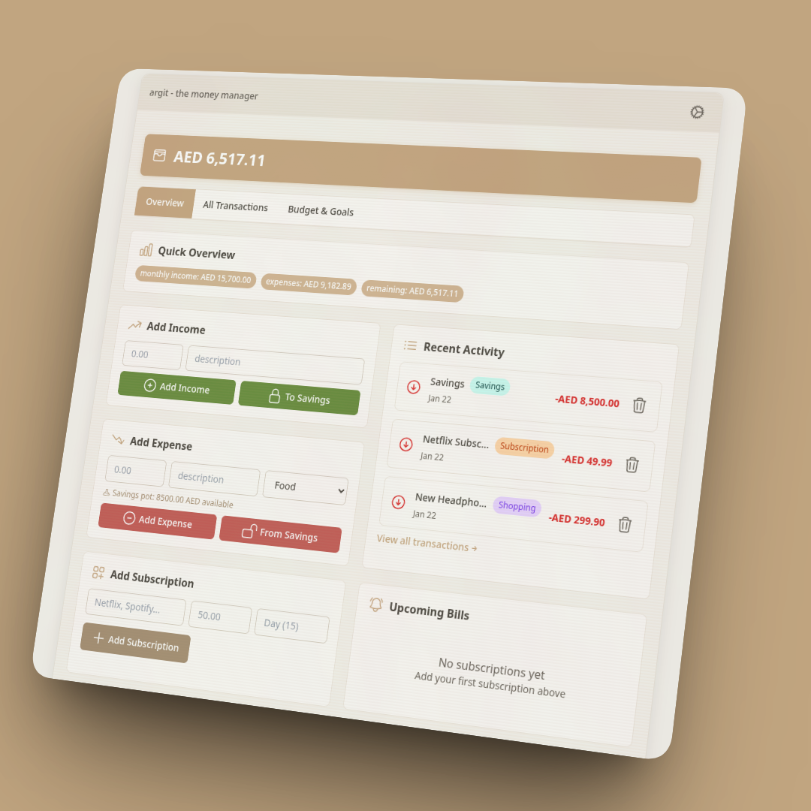
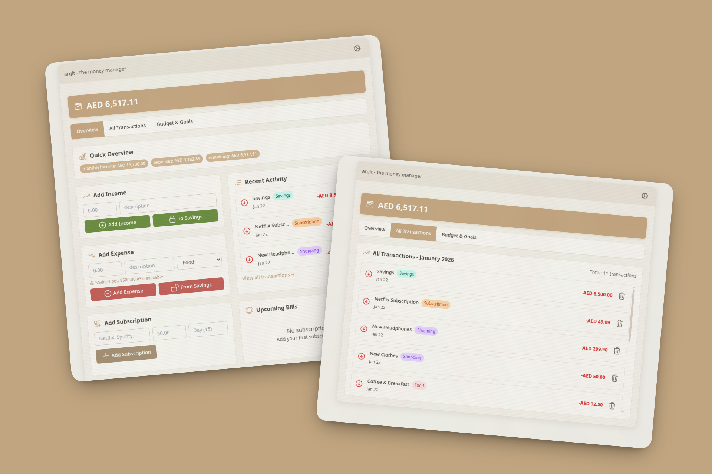
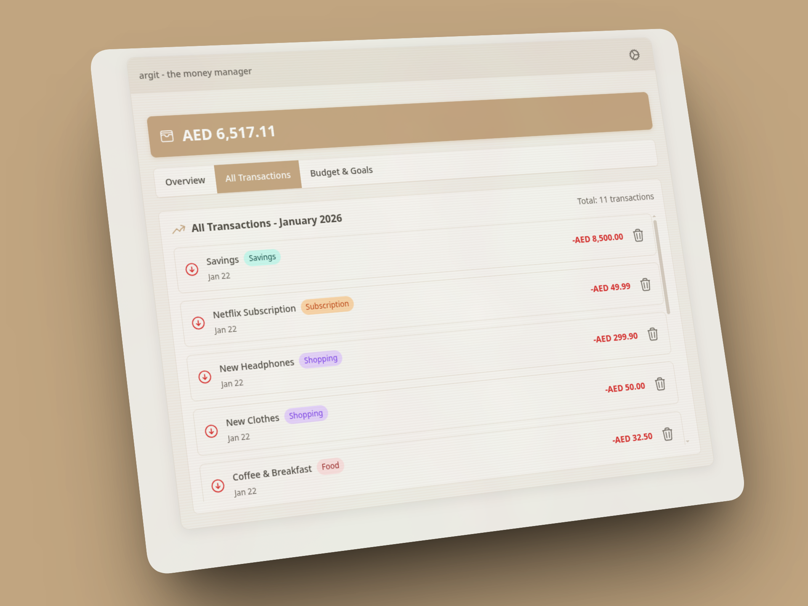
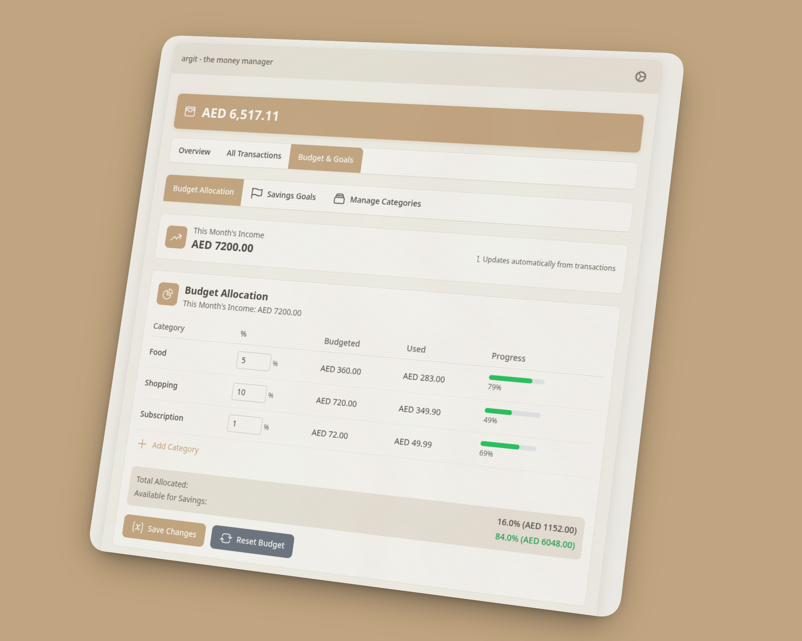
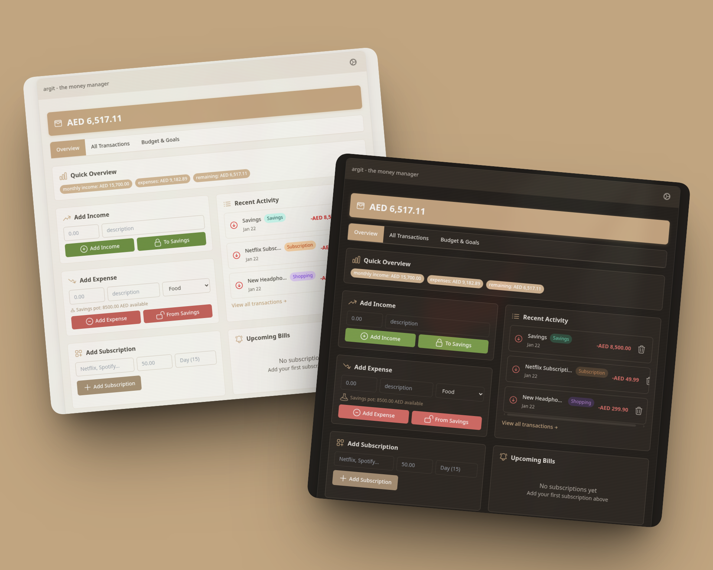
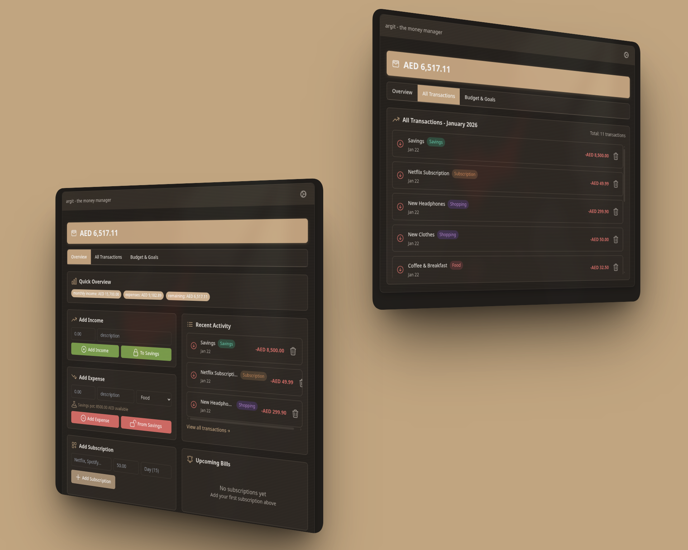
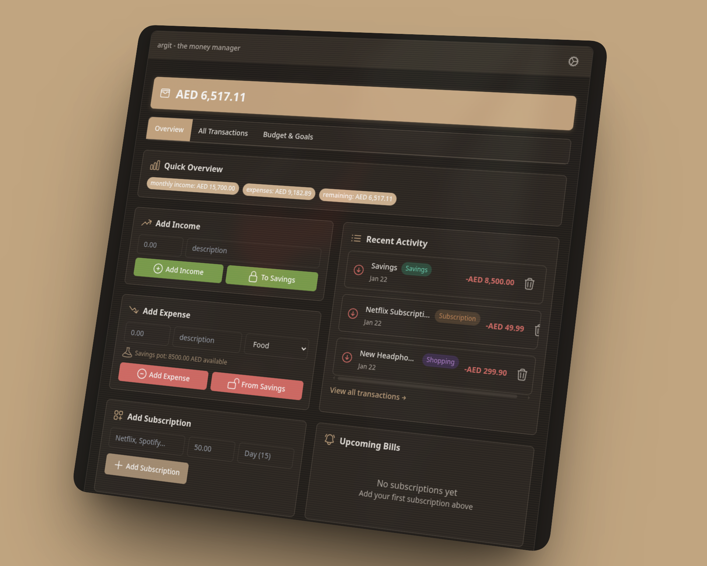

<!-- Improved compatibility of back to top link: See: https://github.com/othneildrew/Best-README-Template/pull/73 -->
<a id="readme-top"></a>

<!-- PROJECT SHIELDS -->
[![Forks][forks-shield]][forks-url]
[![Stargazers][stars-shield]][stars-url]
[![Issues][issues-shield]][issues-url]
[![License][license-shield]][license-url]

<!-- PROJECT LOGO -->
<br />
<div align="center">
  <a href="https://github.com/m-jay21/Argit">
    
  </a>

<h3 align="center">Argit</h3>

  <p align="center">
    A modern, privacy-focused desktop personal finance tracker
    <br />
    <a href="https://github.com/m-jay21/Argit"><strong>Explore the docs »</strong></a>
    <br />
    <br />
    <a href="https://github.com/m-jay21/Argit/issues/new?labels=bug&template=bug-report---.md">Report Bug</a>
    &middot;
    <a href="https://github.com/m-jay21/Argit/issues/new?labels=enhancement&template=feature-request---.md">Request Feature</a>
  </p>
</div>

<!-- TABLE OF CONTENTS -->
<details>
  <summary>Table of Contents</summary>
  <ol>
    <li>
      <a href="#about-the-project">About The Project</a>
      <ul>
        <li><a href="#built-with">Built With</a></li>
        <li><a href="#screenshots">Screenshots</a></li>
      </ul>
    </li>
    <li>
      <a href="#getting-started">Getting Started</a>
      <ul>
        <li><a href="#prerequisites">Prerequisites</a></li>
        <li><a href="#installation">Installation</a></li>
      </ul>
    </li>
    <li><a href="#usage">Usage</a></li>
    <li><a href="#features">Features</a></li>
    <li><a href="#configuration">Configuration</a></li>
    <li><a href="#building-for-production">Building for Production</a></li>
    <li><a href="#contributing">Contributing</a></li>
    <li><a href="#license">License</a></li>
    <li><a href="#acknowledgments">Acknowledgments</a></li>
  </ol>
</details>

<!-- ABOUT THE PROJECT -->
## About The Project

Argit is a beautiful, privacy-focused desktop application for tracking your income, expenses, budgets, subscriptions, and savings goals. All your financial data stays local on your machine—no cloud, no accounts, no subscriptions.

Perfect for individuals who want:
- **Privacy-first** financial tracking (no cloud sync, no accounts)
- **Simple, visual** budget management
- **Automatic** pay-day processing and surplus tracking
- **Smart** subscription management with bill date tracking
- **Goal-oriented** savings planning
- **Customizable themes** including support for btop theme files

<p align="right">(<a href="#readme-top">back to top</a>)</p>

### Built With

* [![React][React.js]][React-url]
* [![Electron][Electron.js]][Electron-url]
* [![Vite][Vite.js]][Vite-url]
* [![Tailwind CSS][Tailwind.css]][Tailwind-url]

<p align="right">(<a href="#readme-top">back to top</a>)</p>

### Screenshots

<div align="center">
  
  
  
  
  
  
  
</div>

<p align="right">(<a href="#readme-top">back to top</a>)</p>

<!-- GETTING STARTED -->
## Getting Started

This section will guide you through setting up Argit on your local machine.

### Prerequisites

* **Node.js** 18+ and npm
  ```sh
  # Check if Node.js is installed
  node --version
  npm --version
  ```

### Installation

1. Clone the repository
   ```sh
   git clone https://github.com/m-jay21/Argit.git
   cd Argit
   ```

2. Install NPM packages
   ```sh
   npm install
   ```

3. Start the development server
   ```sh
   npm start
   ```

The app will open in a new window. The renderer (React) runs on `http://localhost:3000` and Electron connects automatically.

<p align="right">(<a href="#readme-top">back to top</a>)</p>

<!-- USAGE -->
## Usage

### Getting Started

1. **Set Your Starting Balance**
   - Go to Settings
   - Enter your current account balance
   - This becomes your baseline for tracking

2. **Configure Your Budget**
   - Navigate to the Budget tab
   - Set your monthly income
   - Create categories and allocate percentages
   - The app calculates budget amounts automatically

3. **Add Transactions**
   - Use the transaction form on the Overview tab
   - Select income or expense
   - Choose a category
   - Enter amount and description
   - Your balance updates automatically

4. **Track Subscriptions**
   - Add recurring subscriptions with bill dates
   - The app calculates next bill dates automatically
   - View total monthly subscription costs

5. **Set Savings Goals**
   - Create goals with target amounts
   - Choose fixed or percentage contributions
   - Track progress as you save

### Pay Day Processing

Argit automatically processes pay-day surplus:
- Configure your pay day in Settings (recurring date each month)
- Calculates remaining balance on or after pay day
- Moves surplus to savings pot
- Creates transaction backup
- Resets transactions for the new period
- Updates savings pot balance

<p align="right">(<a href="#readme-top">back to top</a>)</p>

<!-- FEATURES -->
## Features

### Transaction Management
- Add income and expense transactions with categories
- Real-time balance calculation and updates
- Transaction history with date filtering
- Support for savings pot deposits and withdrawals
- Automatic transaction categorization

### Budget Management
- Create custom budget categories with percentage allocations
- Visual budget tracking with spent/remaining amounts
- Automatic category spending calculations
- Monthly income allocation across categories
- Budget surplus tracking and distribution

### Subscription Tracking
- Track recurring subscriptions with bill dates
- Smart next-bill-date calculation
- Total monthly subscription cost overview
- Subscription status monitoring

### Savings Goals
- Set multiple savings goals with target amounts
- Fixed or percentage-based monthly contributions
- Track progress toward each goal
- Priority-based goal management
- Automatic allocation from savings pot

### Savings Pot
- Manual savings deposits
- Automatic pay-day surplus allocation
- Track total accumulated savings
- Spend from savings pot with category tracking

### Monthly Statistics
- Current month income and expense summaries
- Net income calculations
- Transaction counts and averages
- Monthly budget performance

### User Experience
- Clean, modern interface
- Multiple theme support (Cozy, Dark, Custom)
- Custom theme support via btop theme files
- System theme detection
- Responsive design
- Intuitive navigation tabs
- Multi-currency support

### Privacy & Security
- All data stored locally on your machine
- No internet connection required
- No account creation or login
- Automatic data backups
- Transaction history backups

<p align="right">(<a href="#readme-top">back to top</a>)</p>

<!-- CONFIGURATION -->
## Configuration

### Data Storage Location

Argit stores all data locally:

- **Linux:** `~/.config/argit/`
- **Windows:** `%APPDATA%/argit/`
- **macOS:** `~/Library/Application Support/argit/`

### Data Files

- `argit-data.json` - Main data file (transactions, budgets, goals, settings)
- `argit-data.backup.json` - Automatic backup
- `transaction-backups/` - Monthly transaction history backups

### Resetting Data

To reset all app data:
```bash
# Linux
rm -rf ~/.config/argit/

# Windows
rmdir /s "%APPDATA%\argit"

# macOS
rm -rf ~/Library/Application\ Support/argit/
```

### Custom Themes

Argit supports custom themes via btop theme files:
1. Go to Settings
2. Select "Custom" theme
3. Click "Select Theme File" to choose a `.theme` file
4. The theme will update in real-time when the file changes

<p align="right">(<a href="#readme-top">back to top</a>)</p>

<!-- BUILDING FOR PRODUCTION -->
## Building for Production

### Build for Current Platform
```bash
npm run dist
```

### Platform-Specific Builds

**Linux (AppImage)**
```bash
npm run dist:linux
```
Output: `dist/Argit-1.7.0.AppImage`

**Windows**
```bash
npm run dist:win
```
Output: 
- `dist/Argit Setup 1.7.0.exe` (NSIS installer)
- `dist/Argit-1.7.0-portable.exe` (Portable version)

**macOS**
```bash
npm run dist:mac
```
Output:
- `dist/Argit-1.7.0.dmg` (DMG installer)
- `dist/Argit-1.7.0-mac.zip` (ZIP archive)

> **Note:** Building for Windows/macOS from Linux may require additional setup. It's recommended to build on the target platform.

### Available Scripts

| Command | Description |
|--------|-------------|
| `npm start` | Start development server (renderer + Electron) |
| `npm run dev:renderer` | Start Vite dev server only |
| `npm run dev:electron` | Start Electron only |
| `npm run build:renderer` | Build React app for production |
| `npm run dist` | Build for current platform |
| `npm run dist:linux` | Build Linux AppImage |
| `npm run dist:win` | Build Windows installers |
| `npm run dist:mac` | Build macOS installers |

<p align="right">(<a href="#readme-top">back to top</a>)</p>

<!-- CONTRIBUTING -->
## Contributing

Contributions are what make the open source community such an amazing place to learn, inspire, and create. Any contributions you make are **greatly appreciated**.

If you have a suggestion that would make this better, please fork the repo and create a pull request. You can also simply open an issue with the tag "enhancement".
Don't forget to give the project a star! Thanks again!

1. Fork the Project
2. Create your Feature Branch (`git checkout -b feature/AmazingFeature`)
3. Commit your Changes (`git commit -m 'Add some AmazingFeature'`)
4. Push to the Branch (`git push origin feature/AmazingFeature`)
5. Open a Pull Request

### Development Guidelines

- Follow existing code style
- Add comments for complex logic
- Test on your target platform before submitting
- Update documentation if adding features

<p align="right">(<a href="#readme-top">back to top</a>)</p>

<!-- LICENSE -->
## License

Distributed under the MIT License. See `LICENSE.txt` for more information.

<p align="right">(<a href="#readme-top">back to top</a>)</p>

<!-- ACKNOWLEDGMENTS -->
## Acknowledgments

* [Electron](https://www.electronjs.org/) - Desktop framework
* [React](https://react.dev/) - UI library
* [Vite](https://vitejs.dev/) - Build tool
* [Electron Builder](https://www.electron.build/) - Packaging tool
* [Tailwind CSS](https://tailwindcss.com/) - CSS framework

<p align="right">(<a href="#readme-top">back to top</a>)</p>

<!-- MARKDOWN LINKS & IMAGES -->
<!-- https://www.markdownguide.org/basic-syntax/#reference-style-links -->
[forks-shield]: https://img.shields.io/github/forks/m-jay21/Argit.svg?style=for-the-badge
[forks-url]: https://github.com/m-jay21/Argit/network/members
[stars-shield]: https://img.shields.io/github/stars/m-jay21/Argit.svg?style=for-the-badge
[stars-url]: https://github.com/m-jay21/Argit/stargazers
[issues-shield]: https://img.shields.io/github/issues/m-jay21/Argit.svg?style=for-the-badge
[issues-url]: https://github.com/m-jay21/Argit/issues
[license-shield]: https://img.shields.io/github/license/m-jay21/Argit.svg?style=for-the-badge
[license-url]: https://github.com/m-jay21/Argit/blob/master/LICENSE.txt

[React.js]: https://img.shields.io/badge/React-20232A?style=for-the-badge&logo=react&logoColor=61DAFB
[React-url]: https://reactjs.org/
[Electron.js]: https://img.shields.io/badge/Electron-2B2E3A?style=for-the-badge&logo=electron&logoColor=47848F
[Electron-url]: https://www.electronjs.org/
[Vite.js]: https://img.shields.io/badge/Vite-646CFF?style=for-the-badge&logo=vite&logoColor=white
[Vite-url]: https://vitejs.dev/
[Tailwind.css]: https://img.shields.io/badge/Tailwind_CSS-38B2AC?style=for-the-badge&logo=tailwind-css&logoColor=white
[Tailwind-url]: https://tailwindcss.com/
